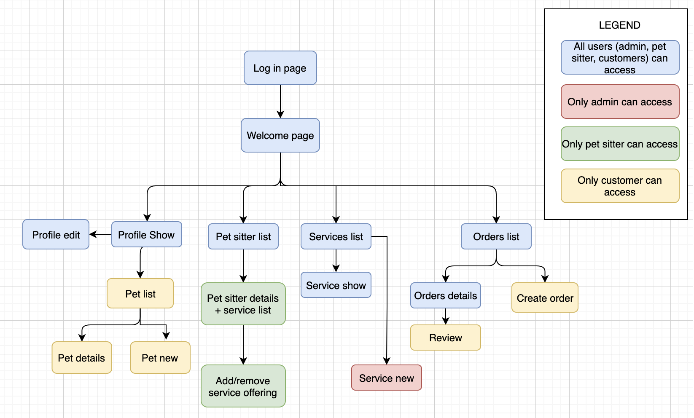
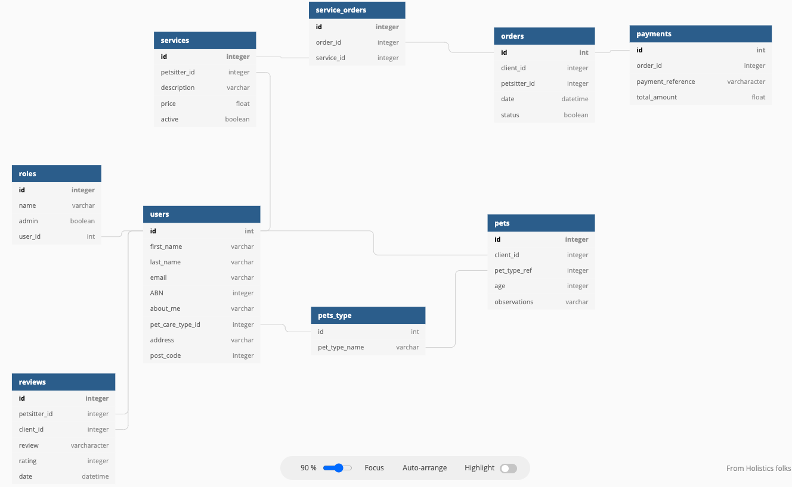
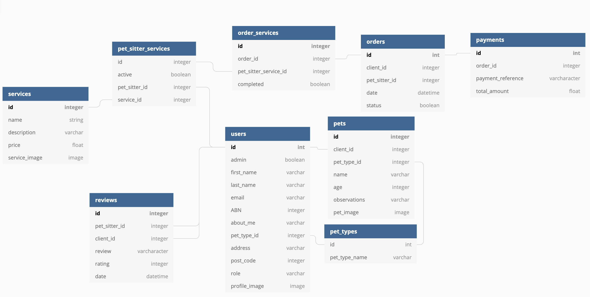
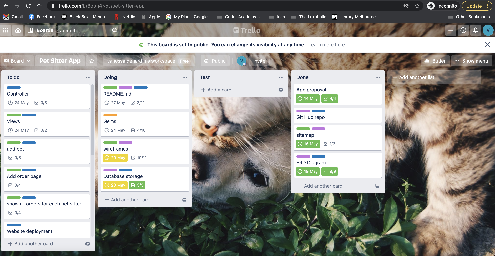
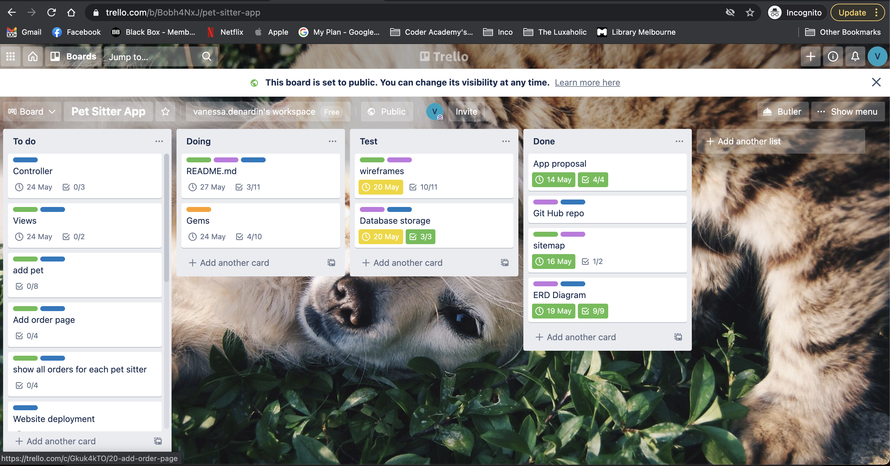
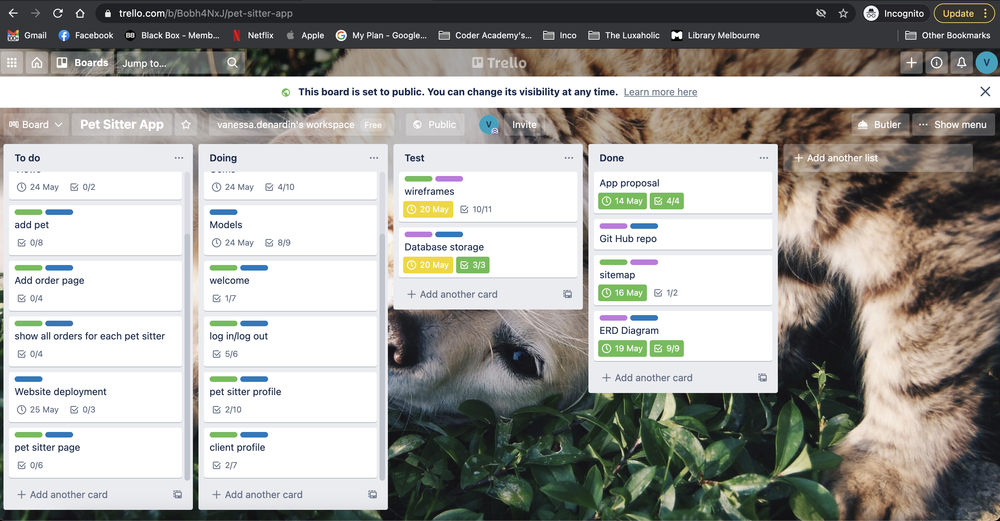
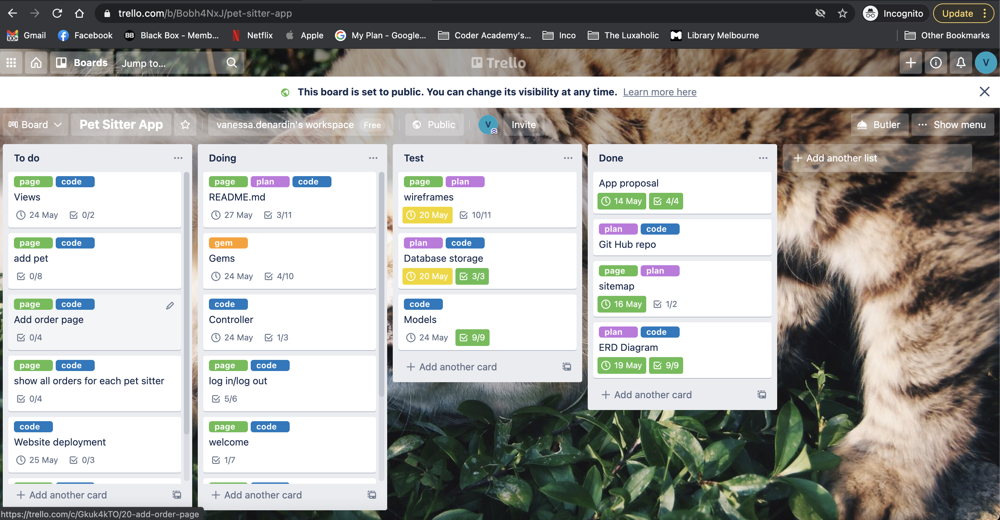
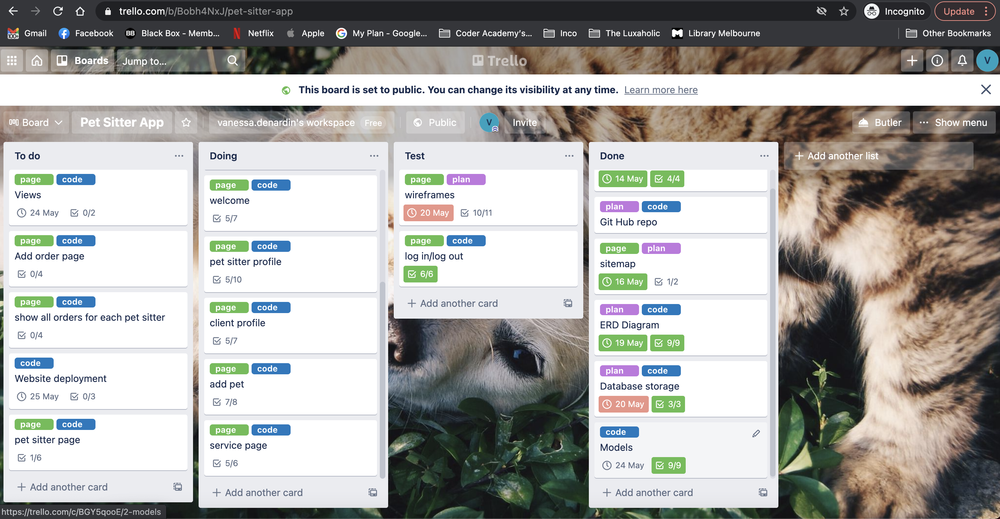
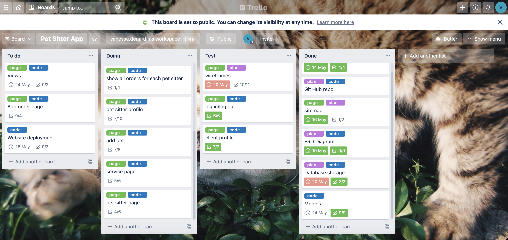
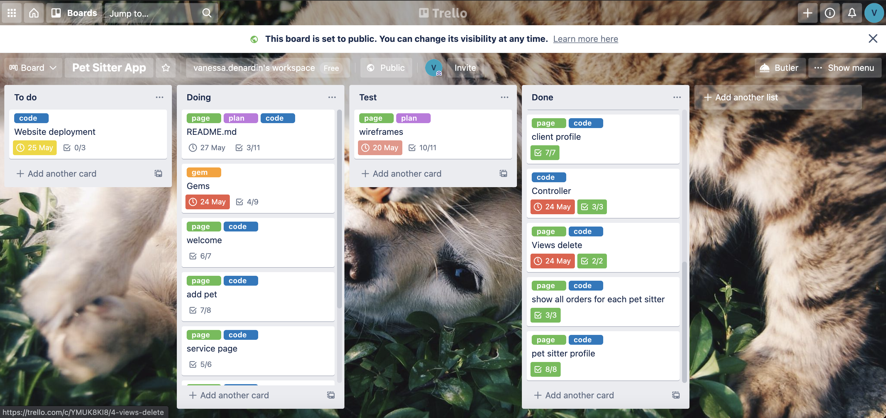

# T2A2 - Marketplace Project

---

# The Pet Sitter Club

---

**Student name:** Vanessa Cibele Cauzzo Denardin

**Student ID:** CAM012112

---

## Table of Contents

- [1. Github repository](#1.-github-repository)
- [2. Website](#2.-Website)
- [3. Purpose](#3.-Purpose)
- [4. Problem/ Solve](#4.-Problem-/-Solve)
- [5. Target Audience](#5.-Target-Audience)
- [6. User Stories](#6.-User-Stories)
- [7. Functionality / features](#7.-Functionality-/-features)
- [8. Sitemap](#8.-Sitemap)
- [9. Tech stack](#9.-Tech-stack)
- [10. Wireframes](#10.-Wireframes)
- [11. ERD](#11.-ERD)
- [12. High-level components (abstractions)](#12.-High-level-components-(abstractions))
- [13. Third party services](#13.-Third-party-services)
- [14. The Pet Sitter Club models in terms of the relationships (active record associations)](#14.-The-Pet-Sitter-Club-models-in-terms-of-the-relationships-(active-record-associations))
- [15. The database relations to be implemented](#15.-The-database-relations-to-be-implemented)
- [16. Database schema design](#16.-Database-schema-design)
- [17. Tasks allocation and tracking](#17.-Tasks-allocation-and-tracking)

---

## 1. Github Repository

[Github repository link](#https://github.com/vanessadenardin/pet-sitter-club)

---

## 2. Website

<!-- [Website link](#) -->

---

## 3. Purpose

The purpose of the 'Pet Sitter Club' is to bring community members together to provide pet care services in your neighbourhood. Although it is simple, considering only dogs and cats as pets at home, it seeks to focus the user experience on the aspect of exchange between users (pet sitter and client through service hiring, client and client through reviews).

## 4. Problem / Solve

Increasingly, it has been noticed that many families have one or more pets. Although services that offer pet care, such as hotels or training and social adaptation schools, are in high demand, there are consumers who seek more personalized services or have animals that do not feel comfortable in environments with other animals.
For this reason, this application was developed to offer a pet sitting service to customers who choose a more personalized service or do not feel comfortable leaving their pets in a hotel during the trip, or who want special activities or training to their pets and due to workload or no experience they are not able to achieve successful results.
The application will act as an intermediary, connecting the pet sitter to the client interested in the service, considering the proximity between the clients and the pet sitters.

---

## 5. Target Audience

The target audience of this app is anyone who has a pet at home or is interested in taking care of a pet and making money from it.

---

## 6. User Stories

- **As admin**

- As the application admin I want to check all clients registered in the application to analyse the website performance

- As the application admin I want to check all orders placed in the last month to analyse the website success

- As the application admin I want to check all new pet sitters registered to analyse how the application usage is spreading

- **As pet sitter**

- As a pet sitter I want to create an account to offer my services in my region

- As a pet sitter I want to create a list of all services that I provide for my potential clients

- As a pet sitter I want to check all my daily orders before leaving home

- As a pet sitter I want to check all reviews received in the last month

- As a pet sitter I want to add pictures of all my clients’ pets while performing my services

- **As client**

- As a client I want to register my pets to hire the adequate pet sitter for the service

- As a client I want to add the specifications for care to all my pets

- As a client I want to give a fair review to the pet sitter that looked after my pet while I was away

- As a client I want to hire a person to be training my puppy

- As a client I want to check details of the last pet sitter that walked my dog

---

## 7. Functionality / features

As functionalities present on the website are:

<!-- - **In-site search** to give a better explanation about the service offered -->
- **Photo gallery** to insert in the profile of the pet as a customer and add the profile of the pet sitter to humanize the contact between customer and service provider, in addition to illustrating the services offered throughout the app
<!-- - Search ??? -->
- **Forms** to sign up, edit profile, add and edit pet as a client, leave a review as a client, add seervices as a admin
<!-- - **Event calendar** to book pet care when it's needed -->

As features available are:

- **Company name** displayed in all pages
<!-- - Search bar -->
<!-- - Logo -->
- **Navigation bar** to facilitate user easily access different pages.
- **Call to action button** with the purpose of sign up to the website and as a client, also to place an order when needed.
- **Images** to provide some sort of visual to meet pet sitters available and to the pet sitters to prepare for the fur-clients before service.
- **Internal links** to encourage user stay longer on the website, also to advertise relevant content.
- **Customer reviews** include some previous client's experience after hiring services from a pet sitter that could be useful for potential customers.
- **Tabs** familiarizing the user with the app
<!-- - **Social Media links** to approximate clients and company, making easier customers discover about a new promotion or any change in the company. -->
- **Contact info** giving users a way to get in touch faster with the company for extra information or support.
<!-- - **Contact form** is another way that customers can get in touch with the pet sitter to gather information. -->
- **Questions & Answers** to help visitors to understand better about the service offered by the company and helping the visitors feel self-sufficient reducing the time awaiting for an answer.

---

## 8. Sitemap
<!-- Não funciona -->

---

## 9. Tech stack

---

## 10. Wireframes

---

## 11. ERD

<!-- não funciona -->

The initial idea when designing the ERD diagram was to have 9 tables being the so-called `roles` that would identify the type of user of the application, which could be admin, client and pet sitter. However, after talking to the educator and carrying out some research, it was decided how to transform the table, previously related to the table `users` in the same column, keeping the name `role`.

<!-- não funciona -->

During the coding path, some necessary modifications were made in the nomenclature and in the associations between the tables. For example, the table `services` is no longer associated with the table `users`, in its place, the table `pet_sitter_services` has been added and works as a junction table between `users` and `services`. In addition, `pet_sitter_services` is associated with the table `order_services`.

The columns were also moved between the tables to facilitate the consultation of the data, for example, the column `price` that was moved from the table `pet_sitter_services` to the table `services`.

---

## 12. High-level components (abstractions)

---

## 13. Third party services

---

## 14. The Pet Sitter Club models in terms of the relationships (active record associations)

---

## 15. The database relations to be implemented

---

## 16. Database schema design

---

## 17. Tasks allocation and tracking

[Trello board The Pet Sitter Club](#https://trello.com/b/Bobh4NxJ/pet-sitter-app)

Below are some screenshots of how the application code was developed, starting with sending the idea to the educator.

After the idea was approved, setting up a Git repository, designing the first ERD and a site map to start the coding process were the steps that followed.

<!-- não funciona -->

<!-- não funciona -->

Then, the following steps were divided in order to respond to all the requirements of the evaluation respecting the sitemap and the wireframes already developed.

From there, the tasks allocated were separated by pages in the application or important methods to be implemented on each page, in addition to the layout features of each page.

<!-- não funciona -->

<!-- não funciona -->

<!-- não funciona -->

<!-- não funciona -->

<!-- não funciona -->

