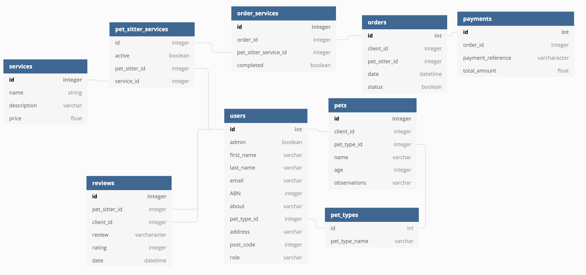

# T2A2 - Marketplace Project

---

# The Pet Sitter Club

---

**Student name:** Vanessa Cibele Cauzzo Denardin

**Student ID:** CAM012112

---

## Table of Contents

- [1. Github repository](#1.-github-repository)
- [2. Website](#2.-Website)
- [3. Purpose](#3.-Purpose)
- [4. Problem/ Solve](#4.-Problem-/-Solve)
- [5. Target Audience](#5.-Target-Audience)
- [6. User Stories](#6.-User-Stories)
- [7. Functionality / features](#7.-Functionality-/-features)
- [8. Sitemap](#8.-Sitemap)
- [9. Tech stack](#9.-Tech-stack)
- [10. Wireframes](#10.-Wireframes)
- [11. Application screenshots](#11.-Application-screenshots)
- [12. ERD](#11.-ERD)
- [13. High-level components (abstractions)](#12.-High-level-components-(abstractions))
- [14. Third party services](#13.-Third-party-services)
- [15. The Pet Sitter Club models in terms of the relationships (active record associations)](#14.-The-Pet-Sitter-Club-models-in-terms-of-the-relationships-(active-record-associations))
- [16. The database relations to be implemented](#15.-The-database-relations-to-be-implemented)
- [17. Database schema design](#16.-Database-schema-design)
- [18. Tasks allocation and tracking](#17.-Tasks-allocation-and-tracking)

---

## 1. Github Repository

[Github repository link](#https://github.com/vanessadenardin/pet-sitter-club)

---

## 2. Website

[Website link](#https://pet-sitter-club.herokuapp.com/)

---

## 3. Purpose

The purpose of 'The Pet Sitter Club' is to bring community members together to provide pet care services in your neighbourhood. Although it is simple and the market has a lot of this kind of businesses running. The idea of this project considered only dogs and cats as pets at home, it seeks to focus the user experience on the aspect of exchange between users (pet sitter and client through service hiring, client to client through reviews).

## 4. Problem / Solve

Increasingly, it has been noticed that many families have one or more pets. Although services that offer pet care, such as hotels or training and social adaptation schools, are in high demand, there are consumers who seek more personalized services or have animals that do not feel comfortable in environments with other animals.
For this reason, this application was developed to offer a pet sitting service to customers who choose a more personalized service or do not feel comfortable leaving their pets in a hotel during the trip, or who want special activities or training to their pets and due to workload or no experience they are not able to achieve successful results.
The application will act as an intermediary, connecting the pet sitter to the client interested in the service, considering the proximity between the clients and pet sitters, inspired from a similar idea of pet sitter hire Mad Paws ('https://www.madpaws.com/').

---

## 5. Target Audience

The target audience of this app is anyone who has a pet at home or is interested in taking care of a pet and making money from it.

---

## 6. User Stories

- **As admin**

- As the application admin I want to check all clients registered in the application to analyse the website performance

- As the application admin I want to check all orders placed in the last month to analyse the website success

- As the application admin I want to check all new pet sitters registered to analyse how the application usage is spreading

- **As pet sitter**

- As a pet sitter I want to create an account to offer my services in my region

- As a pet sitter I want to create a list of all services that I provide for my potential clients

- As a pet sitter I want to check all my daily orders before leaving home

- As a pet sitter I want to check all reviews received in the last month

- As a pet sitter I want to add pictures of all my clients’ pets while performing my services

- **As client**

- As a client I want to register my pets to hire the adequate pet sitter for the service

- As a client I want to add the specifications for care to all my pets

- As a client I want to give a fair review to the pet sitter that looked after my pet while I was away

- As a client I want to hire a person to be training my puppy

- As a client I want to check details of the last pet sitter that walked my dog

---

## 7. Functionality / features

As functionalities present on the website are:

- **Photo gallery** client can insert a profile of the pet; the pet sitter can add a profile photo to humanize the contact between customer and service provider, in addition images that illustrate the services offered throughout the app
- **Search bar** to search for a pet sitter to book the service
- **Forms** to sign up, edit profile, add and edit pet as a client, leave a review as a client, add seervices as a admin
- **Event calendar** to book pet care when it's needed

As features available are:

- **Company name** displayed in all pages
- **Navigation bar** to facilitate user easily access different pages.
- **Call to action button** with the purpose of sign up to the website and as a client, also to place an order when needed.
- **Images** to provide some sort of visual to meet pet sitters available and to the pet sitters to prepare for the fur-clients before service.
- **Internal links** to encourage user stay longer on the website, also to advertise relevant content.
- **Customer reviews** include some previous client's experience after hiring services from a pet sitter that could be useful for potential customers.
- **Tabs** familiarizing the user with the app

---

## 8. Sitemap


---

## 9. Tech stack

- **Front-end:**
  - HTML5
  <!-- - CSS3 -->
  - SCSS
  - Embedded Ruby
  - Bootstrap 4.6.0

- **Back-end:**
  - Ruby 2.7.2p137
  - Rails 6.1.3.2.

- **Database:**
  - Postgresql 13

- **Deployment:**
  - Heroku

- **Planning / Management Tools:**
  - Trello
  - Balsamiq

- **Utilities:**
  - Devise
  - Cancancan
  - Simple form
  - AWS S3

- **DevOps:**
  - Git
  - Github
  - VS Code
  - Bundler
  - Yarn

---

## 10. Wireframes

- Homepage available publicly


- Page for website log in


- Homepage available for a user loged in


- Profile page


- Page with pets information


- Page with form to add new pet


- List of pet sitters available in the website


- Pet sitter profile for client


- Service's list available in the website


- Orders page


---

## 11. Application screenshots

- Homepage available publicly


- Services page available publicly


- Homepage when user logged in


- Profile page


- Page with pets information


- Pet sitters available in the website


- Pet sitter profile for client


- Service's list available in the website


- Service's list available for pet sitter


- Service's list available for client


- Client orders page


- Pet sitter orders page


---

## 12. ERD

The initial idea when designing the ERD diagram was to have 9 tables being the so-called `roles` that would identify the type of user of the application, which could be admin, client and pet sitter. However, after talking to the educator and carrying out some research, it was decided how to transform the table, previously related to the table `users` in the same column, keeping the name `role`.


During the coding path, some necessary modifications were made in the nomenclature and in the associations between the tables, as shown below.



For example, the table `services` is no longer associated with the table `users`, in its place, the table `pet_sitter_services` has been added and works as a junction table between `users` and `services`. In addition, `pet_sitter_services` is associated with the table `order_services`.

The columns were also moved between the tables to facilitate the consultation of the data, for example, the column `price` that was moved from the table `pet_sitter_services` to the table `services`.

---

## 13. High-level components (abstractions)

The Pet Sitter Club is a service market application that uses the Ruby on Rails framework. The Ruby on Rails framework is known to be a framework of choice for several market applications, as it presents abstractions that simplify the development process. The views concentrate the minimum logic of the application, the models store the data of the database and the controllers are the methods that provide the logic of the application.

The Pet Sitter Club uses several models to normalize relationships and associations in the database. Contributing to the integrity of the database.

Through the `current_user` determined by the use of Devise when a user visits the website, authorization allows the visualization components to be adequate according to the role that the user exercised when creating an account on the website. The application differentiates client accounts and pet sitters, changing the features available in each role assigned. When a user creates an account, he has to choose the client or the pet sitter role and from there access is granted.

Only the application administrator can add new services and upload an image attachment to illustrate it. Pet sitters can upload a personal image on their profile but it is not mandatory. And clients can add information about pets, including uploading a photo attachment of the animal. For this, Amazon S3 and active storage are used to facilitate the storage of attached images.

---

## 14. Third party services

Third party services used were:

- **Bootstrap:** The framework is used to stylish the pages in the application.

- **Devise:** The Ruby gem is used in the application to manage user authentication. It also provides views features, the current_user function to collaborate with authorizations and the integrity of the database.

- **Cancancan:** The Ruby gem is used for authorization in the application to restrict the accessibility of the application according to the different registered roles `admin`, `pet sitter` and `client` and also for the general public.

- **Simple Form:** The Ruby gem integrated with Bootstrap is used to create forms in HTML for some of the application pages.

- **AWS**
  - S3 Bucket It is used to upload and store images of pets, profile pictures of pet sitters and images to illustrate the services offered in the app.
  <!-- - IAM -->

- **Heroku:** The cloud platform is used for application deployment and management.

- **Github:** The platform is used for the management and storage of the application code.

---

## 15. The Pet Sitter Club models in terms of the relationships (active record associations)

A user `has_many pets`, a pet `belongs_to user` as foreign key `client_id`.

A user `has_many reviews`, an review `belongs_to user` as foreign key `client_id` and also `belongs_to user`as foreign key `pet_sitter_id`.

A user `has_many pet_sitter_services`, a pet sitter service `belongs_to user`, as foreing key `pet_sitter_id`.

A user `has_many services`, a service `has_many pet_sitter_services` as  foreign key `service_id`.

A user `has_one_attached image`.

A pet `belongs_to user` as foreing key `client_id`.

A pet `has_one_attached image`.

A pet `belongs_to pet_type` as foreing key `pet_types_id`.

A pet type `has_many pets`, as foreing key `pet_types_id`.

A review `belongs_to order`. 

A pet sitter service `belongs_to service`.

A service `has_one_attached image`.

A order `has_many order_services`, a order service `belongs_to order`.

A order `has_many pet_sitter_service` through `order_services`, a pet sitter service `belongs_to order_service`.

A order `has_many services` through `pet_sitter_services`.

A order `has_one payment`, a payment `belongs_to order`.

A oder service `has_one service` through `pet_sitter_service` and `belongs_to order`.

```ruby
class User < ApplicationRecord  
  has_many :pets, dependent: :destroy, foreign_key: 'client_id'
  has_many :reviews, dependent: :destroy, foreign_key: 'pet_sitter_id'

  has_many :pet_sitter_services, dependent: :destroy, foreign_key: 'pet_sitter_id'
  has_many :services, through: :pet_sitter_services

  has_many :orders, foreign_key: 'pet_sitter_id'
  has_many :orders, foreign_key: 'client_id'

  has_one_attached :image
end
```

```ruby
class PetType < ApplicationRecord
  has_many :pets, foreign_key: 'pet_types_id'
end
```

```ruby
class Pet < ApplicationRecord
  belongs_to :user, foreign_key: 'client_id'
  has_one_attached :image
  belongs_to :pet_type, foreign_key: 'pet_types_id'
end
```

```ruby
class Service < ApplicationRecord
  has_many :pet_sitter_services, foreign_key: 'service_id'
  has_one_attached :image
end
```

```ruby
class PetSitterService < ApplicationRecord
    belongs_to :user, foreign_key: 'pet_sitter_id'
    belongs_to :service
end
```

```ruby
class OrderService < ApplicationRecord
    belongs_to :pet_sitter_service
    has_one :service, through: :pet_sitter_service

    belongs_to :order
end
```

```ruby
class Order < ApplicationRecord
  has_many :order_services, dependent: :destroy
  has_many :pet_sitter_services, through: :order_services
  has_many :services, through: :pet_sitter_services

  has_one :payment, dependent: :destroy
  has_one :review

  belongs_to :client, foreign_key: 'client_id', class_name: 'User'
  belongs_to :pet_sitter, foreign_key: 'pet_sitter_id', class_name: 'User'
end
```

```ruby
class Review < ApplicationRecord
  belongs_to :user, foreign_key: 'client_id'
  belongs_to :user, foreign_key: 'pet_sitter_id'
  belongs_to :order
end
```

```ruby
class Payment < ApplicationRecord
  belongs_to :order
end
```

---

## 16. The database relations to be implemented

Database relationships are implemented using foreign keys in relationships that use `belongs_to` in the relationship model.


---

## 17. Database schema design

The arguments for each table also include `created_at:datetime` and` updated_at:datetime`, in addition to the table reference `table_id:bigint`.

- **Users**

```
    first_name:string
    last_name:string
    email:string
    admin:boolean
    abn:string
    about:text
    address:string
    post_code:integer
    role:string
```

- **Pet types**

```ruby
    pet_type_name:string
```

- **Pets**

```ruby
    client_id:bigint
    pet_types_id:bigint
    name:string
    age:integer
    observations:string
```

- **Pet sitter services**

```ruby
    pet_sitter_id:bigint
    service_id:bigint
    active:boolean
```

- **Services**

```ruby
    name:string
    description:text
    price:decimal
```

- **Order services**

```ruby
  pet_sitter_service_id:bigint
  completed:boolean
  order_id:index
  pet_sitter_service_id:index
```

- **Orders**

```ruby
    client_id:integer
    pet_sitter_id:integer
    date:datetime
    status:boolean
```

- **Reviews**

```ruby
    review:string
    date:datetime
    rating:integer
    pet_sitter_id:bigint
    client_id:bigint
    order_id:bigint
```

- **Payments**

```ruby
    order_id:bigint
    payment_reference:string
    total_amount:decimal
```

---

## 18. Tasks allocation and tracking

[Trello board The Pet Sitter Club](#https://trello.com/b/Bobh4NxJ/pet-sitter-app)

Below are some screenshots of how the application code was developed, starting with sending the idea to the educator.

After the idea was approved, setting up a Git repository, designing the first ERD and a site map to start the coding process were the steps that followed.

<!-- não funciona -->


<!-- não funciona -->


Then, the following steps were divided in order to respond to all the requirements of the evaluation respecting the sitemap and the wireframes already developed.

From there, the tasks allocated were separated by pages in the application or important methods to be implemented on each page, in addition to the layout features of each page.


